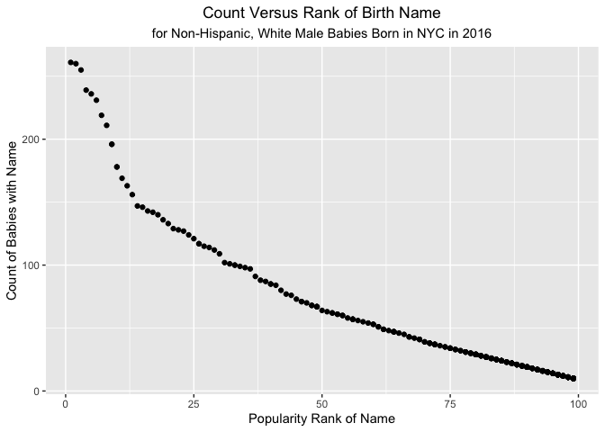

P8105: Data Science I
================
Assignment 2<br>Jimmy Kelliher (UNI: jmk2303)

-   [Problem 1](#problem-1)
    -   [Cleaning the Mr. Trash Wheel
        Dataset](#cleaning-the-mr-trash-wheel-dataset)
    -   [Cleaning the Precipitation Data for 2018 and
        2019](#cleaning-the-precipitation-data-for-2018-and-2019)
    -   [Summarizing the Data](#summarizing-the-data)
-   [Problem 2](#problem-2)
    -   [Cleaning the Monthly Political Affiliation (MPA)
        Dataset](#cleaning-the-monthly-political-affiliation-mpa-dataset)
    -   [Cleaning the S&P 500 Dataset](#cleaning-the-sp-500-dataset)
    -   [Cleaning the Unemployment Rate
        Dataset](#cleaning-the-unemployment-rate-dataset)
    -   [Merging the Three Datasets](#merging-the-three-datasets)
-   [Problem 3](#problem-3)
    -   [Cleaning the Baby Name
        Dataset](#cleaning-the-baby-name-dataset)
    -   [Creating Reader-friendly Summary
        Tables](#creating-reader-friendly-summary-tables)
    -   [Creating a Scatter Plot](#creating-a-scatter-plot)

<!------------------------------------------------------------------------------------------
Preamble
------------------------------------------------------------------------------------------->
<!------------------------------------------------------------------------------------------
Problem 1
------------------------------------------------------------------------------------------->

# Problem 1

## Cleaning the Mr. Trash Wheel Dataset

Let’s talk about trash! We first read and clean the Mr. Trash Wheel
dataset, courtesy of HealthyHarbor.

``` r
# read and clean the Mr. Trash Wheel dataset
mrTrashData <-
  # pull in the data from Excel, omitting non-data entries
  readxl::read_excel(
        path  = "datasets/Trash-Wheel-Collection-Totals-7-2020-2.xlsx"
      , sheet = "Mr. Trash Wheel"
      , range = "A2:N534" # omit the "Grand Total" row
  ) %>%
  # clean up the variable names
  janitor::clean_names() %>%
  # remove rows that aggregate daily data to monthly summaries
  drop_na("dumpster") %>%
  # round number sports balls to the nearest integer
  mutate(sports_balls = as.integer( # convert vector to integer vector
    round(sports_balls, 0)          # round values to zero decimal places
  ))

# output head of data
head(mrTrashData, 10) %>% knitr::kable()
```

| dumpster | month | year | date       | weight\_tons | volume\_cubic\_yards | plastic\_bottles | polystyrene | cigarette\_butts | glass\_bottles | grocery\_bags | chip\_bags | sports\_balls | homes\_powered |
|---------:|:------|-----:|:-----------|-------------:|---------------------:|-----------------:|------------:|-----------------:|---------------:|--------------:|-----------:|--------------:|---------------:|
|        1 | May   | 2014 | 2014-05-16 |         4.31 |                   18 |             1450 |        1820 |           126000 |             72 |           584 |       1162 |             7 |              0 |
|        2 | May   | 2014 | 2014-05-16 |         2.74 |                   13 |             1120 |        1030 |            91000 |             42 |           496 |        874 |             5 |              0 |
|        3 | May   | 2014 | 2014-05-16 |         3.45 |                   15 |             2450 |        3100 |           105000 |             50 |          1080 |       2032 |             6 |              0 |
|        4 | May   | 2014 | 2014-05-17 |         3.10 |                   15 |             2380 |        2730 |           100000 |             52 |           896 |       1971 |             6 |              0 |
|        5 | May   | 2014 | 2014-05-17 |         4.06 |                   18 |              980 |         870 |           120000 |             72 |           368 |        753 |             7 |              0 |
|        6 | May   | 2014 | 2014-05-20 |         2.71 |                   13 |             1430 |        2140 |            90000 |             46 |           672 |       1144 |             5 |              0 |
|        7 | May   | 2014 | 2014-05-21 |         1.91 |                    8 |              910 |        1090 |            56000 |             32 |           416 |        692 |             3 |              0 |
|        8 | May   | 2014 | 2014-05-28 |         3.70 |                   16 |             3580 |        4310 |           112000 |             58 |          1552 |       3015 |             6 |              0 |
|        9 | June  | 2014 | 2014-06-05 |         2.52 |                   14 |             2400 |        2790 |            98000 |             49 |           984 |       1988 |             6 |              0 |
|       10 | June  | 2014 | 2014-06-11 |         3.76 |                   18 |             1340 |        1730 |           130000 |             75 |           448 |       1066 |             7 |              0 |

## Cleaning the Precipitation Data for 2018 and 2019

The Trash Wheel Collection dataset also contains data on monthly
precipitation (in inches) since 2015. For simplicity, we consider
precipitation data for years 2018 and 2019.

``` r
# read and clean the precipitation dataset for year 2018
precipData2018 <-
  # pull in the data from Excel, omitting non-data entries
  readxl::read_excel(
        path  = "datasets/Trash-Wheel-Collection-Totals-7-2020-2.xlsx"
      , sheet = "2018 Precipitation"
      , range = "A2:B14" # omit the annual total in row 15
  ) %>%
  # clean up the variable names
  janitor::clean_names() %>%
  # add ya column for the year
  mutate(year = 2018)

# read and clean the precipitation dataset for year 2019
precipData2019 <-
  # pull in the data from Excel, omitting non-data entries
  readxl::read_excel(
        path  = "datasets/Trash-Wheel-Collection-Totals-7-2020-2.xlsx"
      , sheet = "2019 Precipitation"
      , range = "A2:B14" # omit the annual total in row 15
  ) %>% 
  # clean up the variable names
  janitor::clean_names() %>%
  # add ya column for the year
  mutate(year = 2019)

# combine the datasets
precipDataCombined <-
  bind_rows(
      precipData2018
    , precipData2019
  ) %>%
  # convert month to character
  mutate(month = month.name[month]) %>%
  # set year as the leading variable
  relocate(year)

# output head of data
head(precipDataCombined, 10) %>% knitr::kable()
```

| year | month     | total |
|-----:|:----------|------:|
| 2018 | January   |  0.94 |
| 2018 | February  |  4.80 |
| 2018 | March     |  2.69 |
| 2018 | April     |  4.69 |
| 2018 | May       |  9.27 |
| 2018 | June      |  4.77 |
| 2018 | July      | 10.20 |
| 2018 | August    |  6.45 |
| 2018 | September | 10.47 |
| 2018 | October   |  2.12 |

## Summarizing the Data

The Mr. Trash Wheel dataset consists of data uniquely identified at the
dumpster level. Because the volume of trash generated each day is
random, there may be multiple dumpsters worth of trash reported on a
single day, or there may be no dumpsters worth of trash reported for
weeks at a time. Thus, while we have the date that each dumpter worth of
trash was collected, we should not think of these as time series data.
Data were collected from 2014 to 2021 over a period of 79 months. A
total of 453 dumpsters were collected during this time, implying an
average monthly collection of about 5.73 dumpsters worth of trash. In
2019 alone, Mr. Trash Wheel collected 200 tons of trash, including
116,000 plastic bottles, 329,000 cigarette butts, and 35,000 grocery
bags. The median number of sports balls in a dumpster in 2019 was 9.

The precipitation dataset is much more straightforward: total
precipitation in inches is reported for each month between 2018 and
2019; that is, there are 24 in the combined dataset. The total
precipitation in 2018 was 70.33 inches, and the total precipitation for
2019 was 33.95 inches. Analogously, the average monthly precipitation in
2018 was 5.86 inches, and the average monthly precipitation for 2019 was
2.83 inches. Thus, Mr. Trash Wheel enjoyed a much less rainy year in
2019, with annual precipitation down by 51.73%!

<!------------------------------------------------------------------------------------------
Problem 2
------------------------------------------------------------------------------------------->

# Problem 2

## Cleaning the Monthly Political Affiliation (MPA) Dataset

Let’s begin by importing and cleaning a dataset on political affiliation
over time, courtesy of FiveThirtyEight.

``` r
# read and clean the dataset of political affiliations in government over time
polsData <-
  # pull in the data from CSV
  read_csv("datasets/pols-month.csv") %>%
  # clean up the variable names
  janitor::clean_names() %>%
  # separate month variable into (year, month, day) and convert them to integers
  separate(
      col     = mon
    , into    = c("year", "month", "day")
    , sep     = "-"
    , convert = TRUE # convert new variable to integers
  ) %>% 
  # convert month to character
  mutate(month = month.name[month]) %>%
  # create binary president variable
  mutate(president = recode(
        .x  = prez_dem
      , `0` = "gop"
      , `1` = "dem"
  )) %>%
  # remove extraneous variables
  select(-c(prez_dem, prez_gop, day)) %>%
  # order variables such that (year, month, president) lead
  relocate(year, month, president)

# output head of data
head(polsData, 10) %>% knitr::kable()
```

| year | month     | president | gov\_gop | sen\_gop | rep\_gop | gov\_dem | sen\_dem | rep\_dem |
|-----:|:----------|:----------|---------:|---------:|---------:|---------:|---------:|---------:|
| 1947 | January   | dem       |       23 |       51 |      253 |       23 |       45 |      198 |
| 1947 | February  | dem       |       23 |       51 |      253 |       23 |       45 |      198 |
| 1947 | March     | dem       |       23 |       51 |      253 |       23 |       45 |      198 |
| 1947 | April     | dem       |       23 |       51 |      253 |       23 |       45 |      198 |
| 1947 | May       | dem       |       23 |       51 |      253 |       23 |       45 |      198 |
| 1947 | June      | dem       |       23 |       51 |      253 |       23 |       45 |      198 |
| 1947 | July      | dem       |       23 |       51 |      253 |       23 |       45 |      198 |
| 1947 | August    | dem       |       23 |       51 |      253 |       23 |       45 |      198 |
| 1947 | September | dem       |       23 |       51 |      253 |       23 |       45 |      198 |
| 1947 | October   | dem       |       23 |       51 |      253 |       23 |       45 |      198 |

The 822 observations in the MPA dataset are uniquely identified by the
`year` and `month` variables, and the other 7 variables in the dataset
consist of counts of national politicians by party affiliation (at
least, for the two major political parties in the US). The data are
reported at a monthly frequency from 1947 to 2015. The variable
`president` is binary and indicates whether the sitting president
identified as a Democrat or a Republican. Because there can only be one
president at any time, it makes sense for `president` to be binary.
Other variables count the number of governors, senators, and
representatives by political party in a given month.

## Cleaning the S&P 500 Dataset

We now import and clean monthly data on the closing price of the S&P 500
Index.

``` r
# read and clean the S&P 500 dataset
snpData <-
  # pull in the data from CSV
  read_csv("datasets/snp.csv") %>%
  # clean up the variable names
  janitor::clean_names() %>%
  # separate date variable into (month, day, year) and convert them to integers
  separate(
      col     = date
    , into    = c("month", "day", "year")
    , sep     = "/"
    , convert = TRUE # convert new variable to integers
  ) %>%
  # append century to year
  mutate(year = as.integer(
      year + 1900 + (year < 50) * 100 # note: this will not work on and after year 2050
  )) %>%
  # arrange observations according to (year, month) before month is converted
  arrange(year, month) %>%
  # convert month to character
  mutate(month = month.name[month]) %>%
  # remove extraneous variables
  select(-day) %>%
  # order variables such that (year, month) lead
  relocate(year, month)

# output head of data
head(snpData, 10) %>% knitr::kable()
```

| year | month     | close |
|-----:|:----------|------:|
| 1950 | January   | 17.05 |
| 1950 | February  | 17.22 |
| 1950 | March     | 17.29 |
| 1950 | April     | 17.96 |
| 1950 | May       | 18.78 |
| 1950 | June      | 17.69 |
| 1950 | July      | 17.84 |
| 1950 | August    | 18.42 |
| 1950 | September | 19.45 |
| 1950 | October   | 19.53 |

The 787 observations in the S&P 500 Index dataset are uniquely
identified by the `year` and `month` variables, and the only other
variable gives the close price of the index in the corresponding month.
The data are reported at a monthly frequency from 1950 to 2015. The
average closing price index during this period was 474.89, but with a
range of 2090.34 and a standard deviation of 545.96, this average is
difficult to interpret meaningfully, especially without any adjustment
for inflation.

## Cleaning the Unemployment Rate Dataset

We now import and clean monthly data on the national unemployment rate.

``` r
# read and clean the unemployment dataset
unemploymentData <-
  # pull in the data from CSV
  read_csv("datasets/unemployment.csv") %>%
  # clean up the variable names
  janitor::clean_names() %>%
  # pivot from wide to long format
  pivot_longer(
      cols      = jan:dec
    , names_to  = "month"
    , values_to = "percent_unemployed"
  ) %>%
  # convert year to integer
  mutate(year = as.integer(year)) %>%
  # rename month values to match other datasets
  mutate(month = month.name[
    sapply(month, function(x)             # apply a function to each row in the month variable that...
      which(x ==                          # ... identifies the appropriate index in month.name according to...
        substr(tolower(month.name), 1, 3) # ... the first three characters of elements in month.name
      )
    )
  ])

# output head of data
head(unemploymentData, 10) %>% knitr::kable()
```

| year | month     | percent\_unemployed |
|-----:|:----------|--------------------:|
| 1948 | January   |                 3.4 |
| 1948 | February  |                 3.8 |
| 1948 | March     |                 4.0 |
| 1948 | April     |                 3.9 |
| 1948 | May       |                 3.5 |
| 1948 | June      |                 3.6 |
| 1948 | July      |                 3.6 |
| 1948 | August    |                 3.9 |
| 1948 | September |                 3.8 |
| 1948 | October   |                 3.7 |

The 816 observations in unemployment rate dataset are uniquely
identified by the `year` and `month` variables, and the only other
variable gives the unemployment rate (as a percentage) itself. The data
are reported at a monthly frequency from 1948 to 2015. The average
unemployment rate during this period was 5.83%, and the standard
deviation of the unemployment rate during this period was 1.65%, which
makes for far less noisy data than the S&P 500 Index dataset.

## Merging the Three Datasets

With each of our datasets uniquely identified by the pair (year, month),
we are now prepared to merge them all together. Because we are
interested in analyzing the effect of which party is in power on key
macroeconomic variables, we consider a left join of our MPA dataset to
the two macroeconomic datasets.

``` r
# merge the three datasets
merged538Data <-
  # because polsData is our foundation, we employ a left join of polsData to snpData
  left_join(polsData, snpData, by = c("year", "month")) %>%
  # next we merge in unemploymentData, again via a left join
  left_join(unemploymentData, by = c("year", "month"))

# output tail of data
tail(merged538Data, 10) %>% knitr::kable()
```

| year | month     | president | gov\_gop | sen\_gop | rep\_gop | gov\_dem | sen\_dem | rep\_dem |   close | percent\_unemployed |
|-----:|:----------|:----------|---------:|---------:|---------:|---------:|---------:|---------:|--------:|--------------------:|
| 2014 | September | dem       |       29 |       45 |      234 |       21 |       53 |      199 | 1972.29 |                 5.9 |
| 2014 | October   | dem       |       29 |       45 |      234 |       21 |       53 |      199 | 2018.05 |                 5.7 |
| 2014 | November  | dem       |       29 |       45 |      235 |       21 |       53 |      201 | 2067.56 |                 5.8 |
| 2014 | December  | dem       |       29 |       45 |      235 |       21 |       53 |      201 | 2058.90 |                 5.6 |
| 2015 | January   | dem       |       31 |       54 |      245 |       18 |       44 |      188 | 1994.99 |                 5.7 |
| 2015 | February  | dem       |       31 |       54 |      245 |       18 |       44 |      188 | 2104.50 |                 5.5 |
| 2015 | March     | dem       |       31 |       54 |      245 |       18 |       44 |      188 | 2067.89 |                 5.5 |
| 2015 | April     | dem       |       31 |       54 |      244 |       18 |       44 |      188 | 2085.51 |                 5.4 |
| 2015 | May       | dem       |       31 |       54 |      245 |       18 |       44 |      188 | 2107.39 |                 5.5 |
| 2015 | June      | dem       |       31 |       54 |      246 |       18 |       44 |      188 | 2063.11 |                 5.3 |

We have already discussed at length each of the component datasets of
our merged dataset. By construction, the 822 observations in our merged
dataset are uniquely identified by the `year` and `month` variables, and
the other 9 variables in this dataset correspond to those discussed
previously. The number of observations in our merged dataset equals that
of the MPA dataset, which makes sense given that it was the *left*
dataset of our `left_join`. While we leave a more comprehensive analysis
for a rainy day, this merged data could be employed to tease out the
effect of political affiliation on the stock market and the unemployment
rate, two macroeconomic variables that are important in describing the
health of the economy. As an brief illustration, however, we can see
that the historical mean of closing stock price under Democratic
presidents was 588.26 and under Republican presidents was 378.27.

<!------------------------------------------------------------------------------------------
Problem 3
------------------------------------------------------------------------------------------->

# Problem 3

## Cleaning the Baby Name Dataset

Let’s take a look at the most popular baby names by year, gender, and
ethnicity, courtesy of NYC Open Data.

``` r
# read and clean the dataset of baby names
babyNameData <-
  # pull in the data from CSV
  read_csv("datasets/Popular_Baby_Names.csv") %>%
  # clean up the variable names
  janitor::clean_names() %>%
  # establish more succinct variable names
  rename(year = year_of_birth) %>%
  rename(name = childs_first_name) %>%
  # compensate for string case inconsistencies
  mutate(
      gender    = str_to_title(gender)
    , ethnicity = str_to_title(ethnicity)
    , name      = str_to_title(name)
  ) %>%
  # recode inconsistently named values for ethnicity
  mutate(ethnicity = recode(
      .x               = ethnicity
    , "Asian And Paci" = "Asian And Pacific Islander"
    , "Black Non Hisp" = "Black Non Hispanic"
    , "White Non Hisp" = "White Non Hispanic"
  )) %>%
  # convert categorical predictors to factor variables and doubles to integers, where appropriate
  mutate(
      year      = as.integer(year)
    , gender    = as.factor(gender)
    , ethnicity = as.factor(ethnicity)
    , count     = as.integer(count)
    , rank      = as.integer(rank)
  ) %>%
  # arrange observations according to (year, gender, ethnicity) with year ascending
  arrange(year, gender, ethnicity) %>%
  # remove duplicates
  distinct()

# output head of data
head(babyNameData, 10) %>% knitr::kable()
```

| year | gender | ethnicity                  | name     | count | rank |
|-----:|:-------|:---------------------------|:---------|------:|-----:|
| 2011 | Female | Asian And Pacific Islander | Sophia   |   119 |    1 |
| 2011 | Female | Asian And Pacific Islander | Chloe    |   106 |    2 |
| 2011 | Female | Asian And Pacific Islander | Emily    |    93 |    3 |
| 2011 | Female | Asian And Pacific Islander | Olivia   |    89 |    4 |
| 2011 | Female | Asian And Pacific Islander | Emma     |    75 |    5 |
| 2011 | Female | Asian And Pacific Islander | Isabella |    67 |    6 |
| 2011 | Female | Asian And Pacific Islander | Tiffany  |    54 |    7 |
| 2011 | Female | Asian And Pacific Islander | Ashley   |    52 |    8 |
| 2011 | Female | Asian And Pacific Islander | Fiona    |    48 |    9 |
| 2011 | Female | Asian And Pacific Islander | Angela   |    47 |   10 |

We have addressed several threats to tidiness in the data: (1) values
for `ethnicity` are now consistent across years, (2) the case structure
for `name` is now consistent across years, and (3) duplicate
observations have been removed. Aesthetically, we have also changed
variable names and types where it made sense to do so, and we have
sorted rows according to birth year in ascending order.

## Creating Reader-friendly Summary Tables

We first construct a table that shows the ranking of the female name
Olivia for each ethnicity and for each year.

``` r
# construct table of rankings for Olivia for each ethnicity over time
oliviaTable <-
  babyNameData %>% 
  # keep rows for female babies named Olivia
  filter(gender == "Female", name == "Olivia") %>% 
  # remove extraneous variables
  select(-c(gender, name, count)) %>% 
  # pivot wider to get ethnicity as rows and years as columns
  pivot_wider(
      names_from  = "year"
    , values_from = "rank"
  ) %>%
  # rename variable for presentation purposes
  rename(Ethnicity = ethnicity) %>%
  # pipe into kable for readability
  knitr::kable()

# output table
oliviaTable
```

| Ethnicity                  | 2011 | 2012 | 2013 | 2014 | 2015 | 2016 |
|:---------------------------|-----:|-----:|-----:|-----:|-----:|-----:|
| Asian And Pacific Islander |    4 |    3 |    3 |    1 |    1 |    1 |
| Black Non Hispanic         |   10 |    8 |    6 |    8 |    4 |    8 |
| Hispanic                   |   18 |   22 |   22 |   16 |   16 |   13 |
| White Non Hispanic         |    2 |    4 |    1 |    1 |    1 |    1 |

We next construct a table that shows the most popular male name for each
ethnicity and for each year.

``` r
# construct table of most popular male names for each ethnicity over time
popularMaleNamesTable <-
  babyNameData %>% 
  # keep rows for male babies with rank 1
  filter(gender == "Male", rank == 1) %>% 
  # remove extraneous variables
  select(-c(gender, count, rank)) %>% 
  # pivot wider to get ethnicity as rows and years as columns
  pivot_wider(
      names_from  = "year"
    , values_from = "name"
  ) %>%
  # rename variable for presentation purposes
  rename(Ethnicity = ethnicity) %>%
  # pipe into kable for readability
  knitr::kable()

# output table
popularMaleNamesTable
```

| Ethnicity                  | 2011    | 2012   | 2013   | 2014   | 2015   | 2016   |
|:---------------------------|:--------|:-------|:-------|:-------|:-------|:-------|
| Asian And Pacific Islander | Ethan   | Ryan   | Jayden | Jayden | Jayden | Ethan  |
| Black Non Hispanic         | Jayden  | Jayden | Ethan  | Ethan  | Noah   | Noah   |
| Hispanic                   | Jayden  | Jayden | Jayden | Liam   | Liam   | Liam   |
| White Non Hispanic         | Michael | Joseph | David  | Joseph | David  | Joseph |

## Creating a Scatter Plot

Finally, we construct a scatter plot count againt rank for Non-Hispanic,
White Male Babies Born in NYC in 2016.

``` r
# create scatter plot of count vs rank
babyScatter <-
  # pull entire dataset
  babyNameData %>% 
  # keep rows for white, non-hispanic male babies born in 2016
  filter(
      year      == 2016
    , gender    == "Male"
    , ethnicity == "White Non Hispanic"
  ) %>%
  # instantiate scatter plot
  ggplot(data = ., aes(x = rank, y = count)) + 
  # add points to scatter plot
  geom_point() + 
  # add meta-data
  labs(
      title    = "Count Versus Rank of Birth Name"
    , subtitle = "for Non-Hispanic, White Male Babies Born in NYC in 2016"
    , x        = "Popularity Rank of Name"
    , y        = "Count of Babies with Name"
  ) +
  # center the title of the graph
  theme(
      plot.title   = element_text(hjust = 0.5)
    , plot.subtitle = element_text(hjust = 0.5)
  )

# output scatter plot
babyScatter
```

<!-- -->

Unsurprisingly, count and rank (a function of count) are strongly
related. The relationship between these variables appears exponential
for more common names and linear for less common names. By construction,
the relationship is weakly monotonic.
